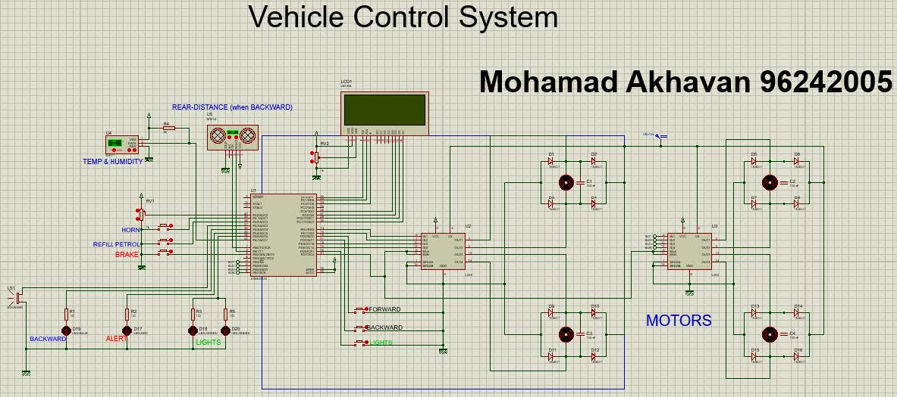

# Vehicle_Control_System_simulator
 Vehicle Control System simulator in Proteus using AVR microcontroller

 ## Files Description:
 - `VehicleControlSystem.C` Controller code
 - `VehicleControlSystem.pdsprj` System simulator in Proteus
 - `DHT.C` The Library for temperature sensor
 - `VehicleControlSystem.hex` Hex file from codeVision

 ## Hardware List:
 - AVR atmega32
 - Sounder (Buzzer) *1
 - Diode 1N4001 *8
 - Driver L298 *2
 - Capacitor (100nf) *4 
 - Motor DC *4
 - Push Button *6
 - Sensor DHT11 *1
 - Potentiometer(1K) *1 
 - Sensor SR04 *1
 - LED *4
 - LCD (20*4) *1
 - Resistors *5

 ## AVR atmega32 features used in this Project:
 - ADC : for reading the voltage of potentiometer to control the speed of the motors
 - Timer 0 : For initializing SRF04 sensor to calculate the time of sending and recieving the waves
 - Timer 2 : Generating PWM signal to adjusting the speed of the motors.
 - Interrupt 0, 1, 2: These three Interrupts are for more precise and better operation of the motor control buttons.

 ## Simulator Operation:
 When you run or launch the simulator, the car's fuel is 100% full and you can move the car forward or backward by pressing the Forward or Backward buttons. The speed of the car can be changed by the potentiometer built into the left side of the micro.

 The machine speed changes between 0 - 255 in Forward mode and between 0 - 30 in Backward mode. It can be viewed in real time on the first line of the LCD.
 If your speed exceeds 200, the warning horn will sound.

 And when in Backward mode, the reverse gear light will turn on.
 Then you can stop the car by pressing the Brake button.
 When the engines are running, the car's fuel is consumed according to their speed.
 Which you can see on the fourth line LCD.

 If the fuel level drops below 15%, the Alert light will turn on.
 And if the fuel runs out, the car will stop and the red Alert light will remain on.
 Then you can refuel at any time by pressing the Refill button. Your fuel will be fully refilled. The Fuel Alert light, if it is on, will turn off.

 The built-in DHT11 sensor displays temperature and humidity on the second line of the LCD.
 The temperature is expressed in Celsius and the humidity in percent.
 You can switch between them in the simulator and change them, and see the changes on the LCD.

 The SRF04 sensor also displays your distance to obstacles on the third line of the LCD when in reverse gear. So only when in reverse gear, this sensor displays the distance to the obstacle. Otherwise, the distance is shown as a dashed line.
 The Lights button is used to turn on the car's headlights, which turns on the LEDs.
 The Horn button can also be used to honk the car.

